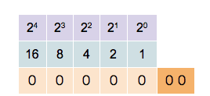

# Binary_Hexadecimal_Converter ♻️
**A simple Decimal Binary Hexadecimal Converter CLI** 💱

**Usage:**
python3 Binary_Hexadecimal_Converter.py

- You can give a decimal number as user input, _for example_, here I gave 16. But it works well with higher numbers. In the the screenshot below, I gave the number 16 as example. 
- **Halo library** is only needed here _for_ _**small animations**_. You can just edit the code as you wish for further speed in calculations, so if you wish don't use that library in the python code.

## **Notes:**

### **Binary Number System:**

 

 - In mathematics and digital electronics, a **binary number**  is a number expressed in the binary numeral system or base-2 numeral system which represents numeric values using two different symbols: typically 0 (zero) and 1 (one).
  - The base-2 system is a positional notation with a radix of 2. Because of its straightforward implementation in digital electronic circuitry using logic gates, the binary system is used internally by almost all modern computers and computer-based devices. Each digit is referred to as a bit.

### **Hexadecimal Number System:**

*In mathematics and computing, hexadecimal (also base 16, or hex) is a positional numeral system with a radix, or base, of 16. It uses sixteen distinct symbols, most often the symbols 0–9 to represent values zero to nine, and A,B,C,D,E,F (or alternatively a, b, c, d, e, f) to represent values ten to fifteen.*

